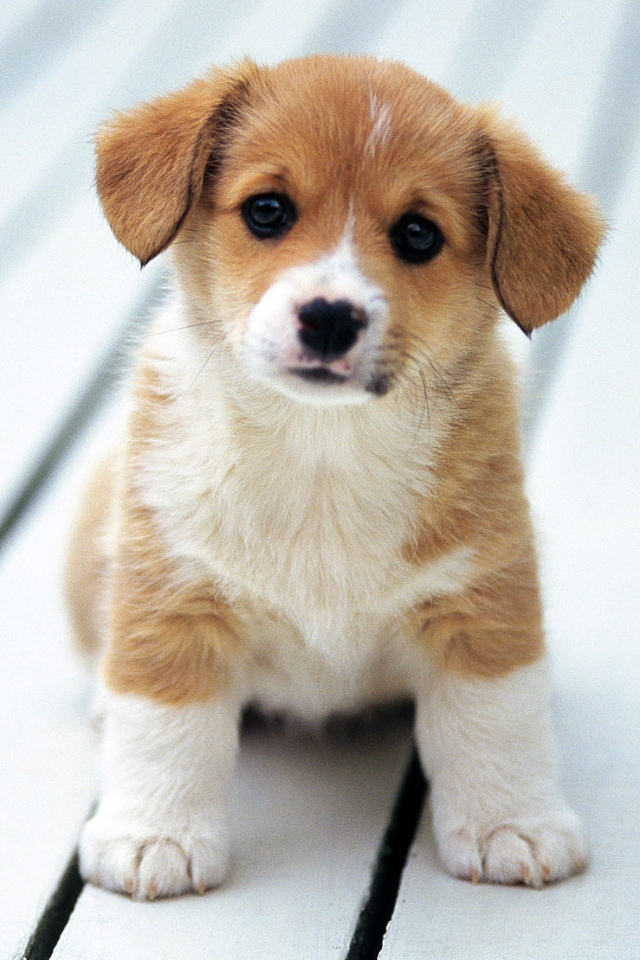
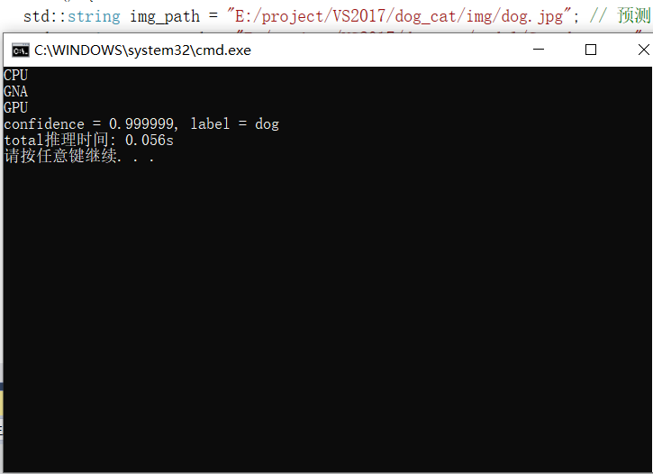
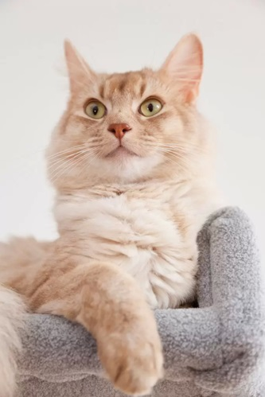
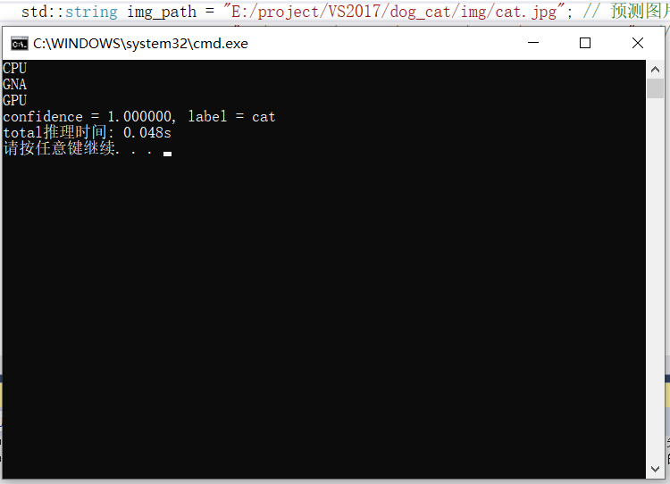

# Openvino_dog_cat

基于c++版的Openvino猫狗识别应用

## 一、教程可以查看

[点击](https://blog.csdn.net/caip12999203000/article/details/128921214?csdn_share_tail=%7B%22type%22%3A%22blog%22%2C%22rType%22%3A%22article%22%2C%22rId%22%3A%22128921214%22%2C%22source%22%3A%22caip12999203000%22%7D)

## 二、结果展示

